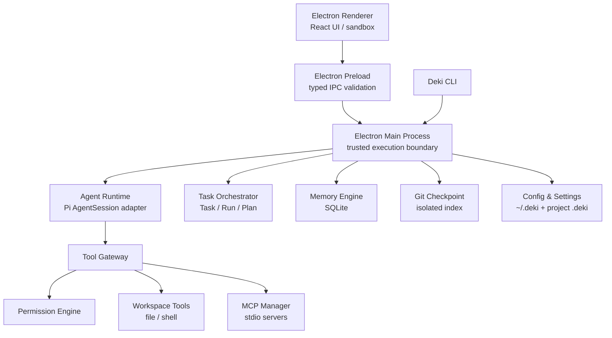

# Deki

> 本地优先、自由扩展的 AI 开发工作台。
> Your local, extensible AI development workspace.

Deki 是一个面向个人开发者的开源 AI 开发工作台。它将模型会话、代码工具、Shell、MCP、Agent Skills、长期记忆、权限审批和 Git Checkpoint 集成在同一个 Electron 桌面应用中，并提供配套的 `deki` CLI 用于启动、诊断和管理。

Deki 基于 Pi Agent Runtime 构建，但不会把底层 SDK 的文件写入或 Shell 能力直接暴露给模型。项目文件、命令和 MCP Tool 都需要通过 Deki 自己的权限网关，在执行前完成路径检查、风险分类和必要的用户确认。

> [!IMPORTANT]
> Deki 当前版本为 `0.0.0`，仍处于早期开发和 PoC 阶段。接口、配置格式和数据结构可能变化，不建议直接用于不可恢复的生产环境。

## 目录

- [核心能力](#核心能力)
- [工作方式](#工作方式)
- [架构概览](#架构概览)
- [快速开始](#快速开始)
- [使用指南](#使用指南)
- [CLI](#cli)
- [MCP Server](#mcp-server)
- [Agent Skills](#agent-skills)
- [权限与安全](#权限与安全)
- [记忆系统](#记忆系统)
- [Git Checkpoint](#git-checkpoint)
- [项目结构](#项目结构)
- [开发与测试](#开发与测试)
- [构建与发布](#构建与发布)
- [本地数据](#本地数据)
- [当前限制](#当前限制)
- [相关文档](#相关文档)

## 核心能力

### 桌面工作台

- Electron + React 桌面界面，支持中文和英文。
- 支持不关联目录的普通会话，以及具备代码工具的项目会话。
- 流式显示模型回复、推理摘要、Tool 调用、权限审批、Diff 和运行状态。
- 支持会话全文搜索、切换、重命名、删除、恢复和消息级分叉。
- 会话异常中断后可恢复，Tool、Diff 和审批 Timeline 会随会话持久化。
- 显示模型上下文占用、输入/输出 Token 和剩余上下文。
- 支持从当前上下文创建独立分叉并并发运行。
- 提供实验性的 Task Center、Plan 面板和受约束 Worker 基础设施。

### 模型与上下文

- 内置 OpenAI、Anthropic、Google Gemini、DeepSeek、Moonshot Kimi、MiniMax、智谱 GLM 和 OpenRouter Provider 模板。
- 支持自定义 OpenAI 兼容 Provider、Base URL、Header、模型上下文长度和输出上限。
- 可分别设置普通会话模型、项目会话模型和推理强度。
- 支持会话内切换模型和上下文压缩。
- API Key 与模型元数据分离保存，Renderer 和诊断导出只能看到 `hasApiKey`。

内置模板只代表 Deki 已提供配置入口；具体模型是否可用、模型名称和账户权限以相应 Provider 为准。

### 代码与工具

受信任项目可以向 Agent 提供以下受控工具：

- `read`：读取工作区文件。
- `grep`：搜索文件内容。
- `find`：查找文件。
- `ls`：列出目录。
- `edit`：修改现有文本。
- `write`：创建或覆盖文件。
- `delete`：删除文件或目录。
- `move`：移动或重命名文件。
- `bash`：执行经过检查和授权的命令。

所有 Tool 都通过统一网关完成参数校验、权限判断、并发控制、结果大小限制和 Secret 脱敏。写入类操作会生成完整 unified diff。

### 扩展与持久化

- 支持项目级和全局 Agent Skills 的发现、校验、禁用、来源更新和版本锁定。
- 支持 stdio MCP Server 的配置、启停、测试、健康检查、超时和自动重连。
- MCP Tool 可以单独启用、禁用和设置 `allow`、`ask`、`deny` 策略。
- 提供 user、project、workspace、branch 和 task 多作用域记忆。
- 使用 SQLite FTS5/BM25 或可移植倒排索引进行记忆检索。
- 受信任 Git 项目可在修改前创建不移动 HEAD 的轻量 Checkpoint。
- 设置支持全局、项目共享、项目本机和当前会话四层覆盖。

## 工作方式

Deki 有两种主要使用场景：

| 模式 | 是否需要项目 | 可用能力 | 适用场景 |
| --- | --- | --- | --- |
| 普通会话 | 否 | 模型对话、用户记忆、会话管理 | 问答、分析、写作和不需要读取本地项目的任务 |
| 项目会话 | 是 | 普通会话能力 + 文件、Shell、Git、项目 Skill、MCP、项目记忆 | 阅读代码、修改项目、运行测试和开发协作 |

普通会话不会读取项目内容，也不会加载项目 Skill、启动项目 MCP Server 或暴露工作区工具。

项目会话需要一个受信任目录。从界面点击“添加项目”选择目录属于显式本机操作，该目录会被直接加入信任列表；通过启动参数传入的新目录仍会显示信任确认。

## 架构概览



Renderer 开启 sandbox 和 context isolation，不能直接访问 Node.js、文件系统或子进程。Main Process 是可信执行边界，负责 IPC 二次校验、工作区信任、Agent 生命周期、工具执行和持久化。

Pi SDK 被限制在 `agent-runtime` 适配层中，界面只消费 Deki 定义的标准事件。这样可以避免 UI 与底层 Agent SDK 的原始事件格式直接耦合。

更完整的模块边界和数据流见[架构文档](docs/architecture.md)。

## 快速开始

### 环境要求

- Node.js `24.18.0`（仓库通过 `.nvmrc` 固定版本）
- pnpm `11.4.0`
- macOS、Linux 或 Windows
- 至少一个受支持云模型的 API Key
- 使用 Git Checkpoint 时，项目需要是 Git 仓库

### 1. 获取并安装依赖

```bash
git clone https://github.com/edik-labs/deki.git
cd deki

nvm install
nvm use
corepack enable
pnpm install --frozen-lockfile
```

如果你不使用 `nvm`，请确保 `node --version` 满足 `>=24.18.0 <25`，并安装准确版本的 pnpm：

```bash
corepack prepare pnpm@11.4.0 --activate
```

### 2. 配置模型

开发时可以先通过环境变量提供一个 API Key：

```bash
export OPENAI_API_KEY="your-api-key"
# 或：
# export ANTHROPIC_API_KEY="your-api-key"
# export GOOGLE_API_KEY="your-api-key"
```

也可以启动应用后进入“设置 → 模型”，添加内置 Provider 或自定义 OpenAI 兼容 Provider。Deki 不读取 `~/.pi/agent/auth.json`。

> [!CAUTION]
> 不要把真实密钥写入 `.env.example`、项目设置、测试、日志或 Git 提交。`.env` 文件默认被 Git 忽略，但 Deki 不会自动加载 dotenv 文件；开发进程仍需从当前 Shell 环境获得变量。

### 3. 启动桌面应用

启动普通会话：

```bash
pnpm dev
```

直接打开指定项目：

```bash
pnpm dev -- --workspace /absolute/path/to/project
```

首次通过启动参数打开一个项目时，需要在应用内确认信任。信任后 Deki 才会加载项目内容、Skill 和 MCP 配置。

### 4. 运行环境诊断

```bash
pnpm deki doctor --workspace .
```

诊断会检查运行环境、模型、Skill、MCP 和 Git 状态。需要机器可读结果时可追加 `--json`。

## 使用指南

### 普通会话

直接运行 `pnpm dev`，或在桌面端创建普通会话。普通会话适合不需要访问本地代码的任务，并且默认只使用用户作用域记忆。

### 项目会话

可以通过以下任一方式打开项目：

1. 在左侧项目区选择“添加项目”并选择目录。
2. 从开发仓库运行 `pnpm dev -- --workspace /absolute/path`。
3. 安装应用后运行 `deki /absolute/path`。

建议在让 Agent 修改代码前确认：

- 当前目录是否正确。
- 工作区是否包含未提交的重要修改。
- 当前权限模式是否符合本次任务。
- Git Checkpoint 是否已启用。
- MCP Server 和项目 Skill 是否来自可信来源。

### 会话命令

可以在消息输入框中使用以下命令：

| 命令 | 作用 |
| --- | --- |
| `/model` | 列出可用模型和当前模型 |
| `/model <provider/model>` | 切换当前会话模型 |
| `/skills` | 查看已加载的 Skill |
| `/mcp` | 查看 MCP Server 状态 |
| `/tools` | 查看当前启用的 Tool |
| `/permissions` | 查看当前权限策略 |
| `/diff` | 查看当前会话最近一次 Diff |
| `/compact [instruction]` | 压缩当前模型上下文 |
| `/resume` | 列出历史会话 |
| `/resume <session-id>` | 恢复指定会话 |
| `/remember <内容>` | 按当前会话类型保存记忆 |
| `/remember --user\|--project\|--workspace\|--branch\|--task <内容>` | 保存到指定作用域 |
| `/memories` | 查看当前可召回的记忆 |
| `/forget <memory-id\|all>` | 删除记忆 |
| `/doctor` | 查看当前 Runtime、模型、Skill 和 MCP 诊断 |

带空格的单个参数可以使用双引号包裹。

### 设置分层

设置按以下优先级合并，越靠前优先级越高：

1. 当前会话设置（仅内存）
2. 项目本机设置：`~/.deki/projects/<workspace-hash>/settings.json`
3. 项目共享设置：`<project>/.deki/settings.json`
4. 全局设置：`~/.deki/settings.json`
5. 产品默认值

设置页会显示每个字段的实际来源。持久化文档带有 revision，发生并发修改时会明确报错，而不是静默覆盖较新的内容。损坏的配置会被保留为 `.corrupt-*`，上一个有效版本保留为 `.bak`。

机器路径、API Key 和 MCP 环境变量不会写入项目共享设置。

## CLI

开发仓库中通过 `pnpm deki <arguments>` 使用 CLI：

```bash
pnpm deki --help
pnpm deki doctor --workspace .
pnpm deki skills list --workspace .
pnpm deki mcp list --workspace .
pnpm deki permissions list --workspace .
pnpm deki audit --limit 20
```

CLI 构建产物位于 `apps/cli/dist/deki.js`。安装后的主要命令包括：

```text
deki [path] [--general]
deki resume [path] [--general]
deki doctor [--workspace path] [--json]

deki models list
deki models import --file provider.json
deki models remove <provider-id>

deki skills list [--workspace path]
deki skills create <name> [--description text]
deki skills validate <path>
deki skills update <path>
deki skills pin|unpin <path>

deki mcp list [--workspace path]
deki mcp add <id> --command cmd [--arg value] [--cwd relative]
deki mcp remove <id>
deki mcp test <id>

deki permissions list [--workspace path]
deki permissions set <category> <allow|ask|deny> [--scope global|project]
deki audit [--limit 100] [--json]

deki checkpoint list [--limit 50]
deki checkpoint create [--message text]
deki checkpoint show <id>
deki checkpoint diff <id>
deki checkpoint restore <id> --yes
deki checkpoint remove <id> --yes
```

常用全局选项：

- `--workspace <path>`：指定工作区。
- `--data-dir <path>`：覆盖默认的 `~/.deki`，适合测试和便携环境。
- `--json`：输出结构化结果。
- `--help`：显示帮助。
- `--version`：显示版本。

CLI 不会输出 API Key。支持 `--json` 的命令也只返回已脱敏的模型元数据和审计记录。完整说明见 [CLI 文档](docs/cli.md)。

## MCP Server

Deki 当前支持以 stdio Transport 运行 MCP Server。项目共享配置位于：

```text
<project>/.deki/mcp.json
```

最小配置示例：

```json
{
  "mcpServers": {
    "example": {
      "command": "node",
      "args": ["./tools/example-mcp-server.mjs"],
      "cwd": ".",
      "enabled": true,
      "tools": {
        "read_status": {
          "enabled": true,
          "permission": "allow",
          "timeoutMs": 30000
        },
        "apply_change": {
          "enabled": true,
          "permission": "ask",
          "timeoutMs": 60000
        }
      }
    }
  }
}
```

也可以通过 CLI 添加和测试：

```bash
pnpm deki mcp add example \
  --command node \
  --arg ./tools/example-mcp-server.mjs \
  --cwd .

pnpm deki mcp test example
```

MCP 环境变量和 Secret 属于机器本地数据，保存在权限为 `0600` 的：

```text
~/.deki/projects/<workspace-hash>/mcp-local.json
```

项目共享的 `.deki/mcp.json` 适合提交 Server 命令、参数和 Tool 策略，不应包含真实 Secret。Server 配置或启用状态变化后，Deki 会重建受影响的 Agent Runtime，使最新 Tool Schema 对模型可见。

当前测试用 Server 位于 `tests/fixtures/mcp-server.mjs`，只用于自动化测试，不是产品预置 MCP Server。

## Agent Skills

Deki 会从以下目录发现 Skill：

```text
# 项目级
<project>/.deki/skills/
<project>/.agents/skills/
<project>/.pi/skills/

# 全局兼容目录
~/.pi/agent/skills/
~/.agents/skills/
~/.codex/skills/
```

每个 Skill 使用独立目录，并至少包含一个 `SKILL.md`：

```text
.deki/skills/
└── release-helper/
    └── SKILL.md
```

创建和验证项目 Skill：

```bash
pnpm deki skills create release-helper \
  --description "检查版本并生成发布说明"

pnpm deki skills validate .deki/skills/release-helper
pnpm deki skills list --workspace .
```

Deki 会报告 Skill 的来源、格式错误、名称冲突、依赖诊断和版本锁定状态。只有受信任项目会加载项目 Skill；使用第三方 Skill 前应先阅读其 `SKILL.md` 和附带脚本。

## 权限与安全

### 权限模式

消息编辑器提供三种会话级权限模式：

| 模式 | 行为 |
| --- | --- |
| 请求批准 | 普通读取和低风险修改可执行，较高风险操作先询问 |
| Agent 决定 | 仅在高风险边界前询问 |
| 完全访问 | 当前会话允许所有权限类别，不再弹出 Tool 审批 |

“完全访问”也会覆盖当前 Runtime 的 MCP Tool 策略。它适合用户明确控制的隔离或可恢复环境，不代表 Deki 提供了系统级 Sandbox。

底层策略按类别使用 `allow`、`ask` 或 `deny`：

- 项目读取和普通文本编辑默认允许。
- 删除、依赖安装、Git 写入和复杂 Shell 默认询问。
- 敏感文件、提权和工作区外路径默认询问或拒绝。
- MCP Tool 根据只读或潜在修改能力分类。

### 安全边界

- Renderer 无 Node.js 权限，并启用 sandbox 与 context isolation。
- IPC 输入会在 Preload 和 Main Process 分别校验。
- 未信任项目不会加载项目 Skill、启动项目 MCP 或暴露项目 Tool。
- Shell 会拒绝明确的工作区外路径、敏感路径、嵌套 Shell、命令替换、内联解释器和动态求值等危险形式。
- Tool 输出在离开网关前执行大小限制和 Secret 脱敏。
- 审批超时等同拒绝。
- 修改结果和审批决定会写入脱敏审计日志。
- Deki 默认关闭遥测。

> [!WARNING]
> 当前版本没有真实的 OS/容器 Sandbox。权限网关、路径检查和 Git Checkpoint 能降低风险，但不能替代虚拟机、容器、专用测试账户或完善的备份。不要在包含生产凭据、不可恢复数据或高权限环境的目录中运行不可信任务。

安全问题请按照 [SECURITY.md](SECURITY.md) 中的流程报告，不要在公开 issue 中提交 Token、私有代码或可直接利用的漏洞细节。

## 记忆系统

Deki 的长期记忆保存在本地 SQLite 数据库中，支持以下作用域：

| 作用域 | 隔离方式 | 适合内容 |
| --- | --- | --- |
| `user` | 当前用户 | 长期偏好、通用习惯 |
| `project` | 项目标识 | 项目约定、技术背景 |
| `workspace` | 工作区路径 | 当前工作副本的特殊规则 |
| `branch` | 工作区 + Git HEAD | 分支目标、临时实现决策 |
| `task` | Pi Session ID | 当前任务约束、进度和待办 |

示例：

```text
/remember --user 我偏好 pnpm 和严格 TypeScript
/remember --project 发布前必须运行 pnpm typecheck
/remember --branch 当前分支只处理设置页重构
/remember --task 下一步需要补充 Electron smoke test
```

每轮提问会分别检索适用作用域，并为数量、字符数和 Token 使用独立预算。运行环境支持 FTS5 时使用 BM25 全文检索，否则自动回退到 SQLite 词项倒排索引；最终排序还会考虑置顶、置信度和时间衰减。

自动记忆默认关闭。开启后，模型最多生成三个待确认候选；候选只有经用户接受后才会参与后续召回。系统还会处理冲突替代、到期归档和低置信度归档，并过滤常见 Token、密码和私钥形式。

## Git Checkpoint

在受信任 Git 项目中，Deki 可以在 Agent 执行写入、删除、移动或潜在修改型 Shell 命令之前自动创建 Checkpoint。

Checkpoint 使用独立的临时 Git index 构建 tree 和 commit，并保存到：

```text
refs/deki/checkpoints/<id>
```

它不会：

- 执行普通的 `git commit`。
- 移动 `HEAD`。
- 切换当前分支。
- 修改用户的暂存区。
- 包含被 `.gitignore` 忽略的文件。

常用命令：

```bash
pnpm deki checkpoint create \
  --workspace . \
  --message "before refactor"

pnpm deki checkpoint list --workspace .
pnpm deki checkpoint show <id> --workspace .
pnpm deki checkpoint diff <id> --workspace .
pnpm deki checkpoint restore <id> --workspace . --yes
```

恢复前 Deki 会先创建 safety checkpoint。恢复只更新工作区内容，不会删除当前存在但目标 Checkpoint 中没有的未跟踪文件。

## 项目结构

```text
deki/
├── apps/
│   ├── desktop/              # Electron 主进程、Preload、React Renderer
│   └── cli/                  # deki CLI
├── packages/
│   ├── agent-runtime/        # Pi AgentSession 适配、会话与 Tool 事件
│   ├── agent-supervisor/     # Agent/Worker 生命周期管理
│   ├── config/               # ~/.deki、信任和 MCP 配置
│   ├── git-checkpoint/       # 独立 index 与 refs/deki/checkpoints
│   ├── mcp-manager/          # stdio MCP 生命周期和健康检查
│   ├── memory-engine/        # SQLite 记忆、检索和治理
│   ├── permission-engine/    # Tool 风险分类与授权决策
│   ├── settings/             # 分层设置、revision 和恢复
│   ├── shared/               # IPC Schema、共享类型和常量
│   ├── task-orchestrator/    # Task、Run、Plan 和事件存储
│   └── tool-gateway/         # Tool 注册、校验、脱敏和并发控制
├── docs/                     # 架构、CLI、开发、权限和发布文档
├── scripts/                  # 打包、Release 和许可证校验脚本
├── tests/
│   ├── electron/             # Playwright Electron smoke tests
│   └── fixtures/             # 测试专用 MCP fixture
├── package.json
└── pnpm-workspace.yaml
```

这是一个 pnpm workspace monorepo。内部包通过 `workspace:*` 引用，并直接导出 TypeScript 源码供桌面应用构建。

## 开发与测试

### 常用脚本

| 命令 | 作用 |
| --- | --- |
| `pnpm dev` | 启动 Electron 开发环境 |
| `pnpm cli:build` | 单独构建 CLI |
| `pnpm deki <args>` | 构建并运行仓库内 CLI |
| `pnpm lint` | 运行 ESLint |
| `pnpm typecheck` | 运行 TypeScript 类型检查 |
| `pnpm test` | 运行 Vitest 单元测试 |
| `pnpm test:watch` | 监听模式运行 Vitest |
| `pnpm test:electron` | 构建并运行 Playwright Electron 测试 |
| `pnpm test:electron:launch` | 运行轻量 Electron 启动检查 |
| `pnpm build` | 构建 CLI 和桌面应用 |
| `pnpm package:dir` | 生成未签名目录包 |
| `pnpm package` | 生成当前平台安装器 |
| `pnpm license:generate` | 生成第三方许可证清单 |

推荐在提交前运行：

```bash
pnpm lint
pnpm typecheck
pnpm test
pnpm build
```

涉及 Electron 主进程、Preload、Renderer IPC 或打包配置时，再运行：

```bash
pnpm test:electron
pnpm package:dir
```

CI 在 macOS、Ubuntu 和 Windows 上执行安装、Lint、类型检查、单元测试、构建、Electron smoke test 和目录打包。

### 贡献要求

1. 使用 `.nvmrc` 和 `package.json` 指定的 Node.js/pnpm 版本。
2. 从 `main` 创建短生命周期分支。
3. 为行为变化补充测试和文档。
4. 涉及文件写入、Shell、MCP、Secret、IPC 或记忆召回时，在 PR 中说明安全边界和失败方式。
5. 每个提交都需要 DCO 签署行，可使用 `git commit -s`。

详见 [CONTRIBUTING.md](CONTRIBUTING.md) 和 [CODE_OF_CONDUCT.md](CODE_OF_CONDUCT.md)。

## 构建与发布

本地构建当前平台安装器：

```bash
pnpm package          # 当前平台正式格式
pnpm package:dir      # 未签名目录包，适合快速验证
pnpm package:mac      # macOS DMG + ZIP，Universal
pnpm package:win      # Windows NSIS + Portable，x64
pnpm package:linux    # Linux AppImage + DEB，x64
```

输出目录为 `release/`。没有签名证书时，本地产物仅适合开发验证，不应作为正式版本分发。

正式 Release 通过 SemVer Tag 触发 GitHub Actions：

- macOS：Universal DMG/ZIP、Developer ID 签名、公证和 Staple。
- Windows：x64 NSIS/Portable、Authenticode SHA-256 签名和时间戳。
- Linux：x64 AppImage/DEB。
- 附带 SHA-256 校验和、CycloneDX SBOM 和 GitHub Artifact Attestation。
- 为 Stable/Beta 通道生成 `electron-updater` 更新元数据。

完整版本同步、签名 Secret 和验证步骤见[发布文档](docs/releasing.md)。

## 本地数据

Deki 默认将用户数据保存在 `~/.deki/`。测试时可以使用环境变量 `DEKI_HOME`，CLI 也支持 `--data-dir` 指定其他目录。

```text
~/.deki/
├── config.json                         # 受信任和最近使用的工作区
├── settings.json                       # 全局设置
├── models.json                         # Provider 与 API Key，权限 0600
├── sessions/
│   └── <workspace-hash>/               # Pi JSONL 会话和 Timeline
├── memory/
│   └── memory.db                       # 长期记忆
├── tasks/
│   └── tasks.db                        # Task、Run、Plan 和 Artifact
├── projects/
│   └── <workspace-hash>/
│       ├── settings.json               # 项目本机设置
│       └── mcp-local.json              # MCP 环境变量，权限 0600
└── logs/
    └── audit-YYYY-MM-DD.jsonl           # 脱敏权限审计和 Diff
```

项目中可以存在以下可共享配置：

```text
<project>/.deki/
├── settings.json
├── mcp.json
└── skills/
```

Deki 是“本地优先”而不是“完全离线”：会话、设置、记忆和审计默认保存在本机，但发送给云模型的提示、上下文和 Tool 结果仍会进入所选 Provider。请根据代码和数据敏感度选择模型服务。

## 当前限制

当前版本尚不支持：

- 真实的 OS、容器或虚拟机 Sandbox。
- 本地模型运行时。
- HTTP/Streamable HTTP MCP Transport。
- MCP OAuth、Resources 和 Prompts。
- 内置或自动安装的 MCP Server 市场。
- 桌面应用完全退出后继续执行后台任务的独立 daemon。
- 多 Agent 在独立 Git worktree 中并行写入和自动合并。

另外，当前项目仍处于 `0.0.0`：

- 配置和数据库迁移策略可能继续调整。
- 智能 Plan DAG、按 Profile 的模型路由、持久化预算预留和自动 Reviewer/Integrator 属于默认关闭的实验性能力，可在 Agent 设置中启用；不安全集成冲突会保留证据并要求 Replan。
- 自动更新和正式安装包依赖仓库 Release 流水线与平台签名配置。

规划中的功能请以[产品规划](docs/deki-product-plan.md)和[多 Agent / 后台任务 / Plan 模式规划](docs/multi-agent-background-tasks-plan-mode.md)为参考，不应视为当前版本承诺。

## 相关文档

- [开发环境与验证](docs/development.md)
- [系统架构](docs/architecture.md)
- [CLI 使用说明](docs/cli.md)
- [设置、权限与 Secret 边界](docs/settings-and-permissions.md)
- [发布流程](docs/releasing.md)
- [产品规划](docs/deki-product-plan.md)
- [多 Agent、后台任务与 Plan 模式规划](docs/multi-agent-background-tasks-plan-mode.md)
- [变更记录](CHANGELOG.md)
- [贡献指南](CONTRIBUTING.md)
- [安全策略](SECURITY.md)

## 许可证

Deki 以 [GNU Affero General Public License v3.0 or later](LICENSE) 发布，SPDX 标识为 `AGPL-3.0-or-later`。
