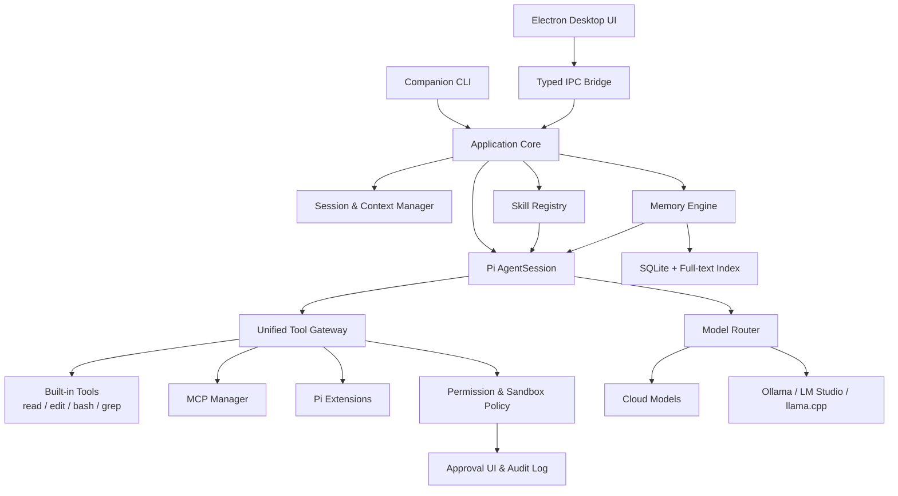
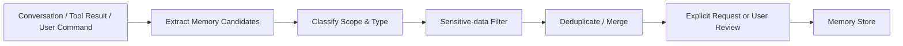

# Deki：基于 Pi Agent 的个人开发工具规划

> 文档状态：初版规划
> 更新日期：2026-07-26

## 1. 项目概述

### 1.1 项目目标

基于 Pi Agent 构建一个个人、本地优先的 AI 开发工具，统一集成：

- 多模型调用
- 代码仓库理解与修改
- Agent Skills
- MCP Server 与 MCP Tools
- 文件、Shell、Git 等开发工具
- 会话、上下文压缩与恢复
- 权限控制、沙箱与审计
- 第一版桌面 UI
- 后续的任务编排和子 Agent 能力

本项目不重新实现完整的 Coding Agent，而是以 Pi Agent 作为 Agent Runtime，在其上建设能力管理、安全策略和产品体验。

### 1.2 产品定位

产品定位为：

> 面向个人开发者的本地 AI 开发工作台。

核心原则：

1. 本地优先，数据默认保存在本机。
2. Pi Agent 负责 Agent Loop、模型调用、会话与基础工具。
3. Skill 负责描述“任务应该怎么做”。
4. MCP 负责提供“Agent 可以调用什么外部能力”。
5. 所有工具调用经过统一权限网关。
6. 第一版即提供桌面 UI，CLI 作为辅助和诊断入口。
7. 项目面向开源发布，默认采用公开、可审计的设计。
8. 从第一天建立 macOS、Linux、Windows 三平台构建和测试能力。

### 1.3 品牌与命名

```text
产品名：Deki
CLI：deki
发布者：Edik Labs
建议仓库：edik-labs/deki
建议 npm scope：@deki-ai/*
用户配置目录：~/.deki/
项目配置目录：.deki/
```

英文口号：

> Your local, extensible AI development workspace.

中文口号：

> 本地优先、自由扩展的 AI 开发工作台。

`Deki` 是 `Edik` 的字母重排，保留创作者的个人印记，同时保持独立、简短的产品品牌。产品、桌面应用、仓库和 CLI 统一使用 `Deki/deki`。

## 2. 技术路线

### 2.1 可选方案

| 方案 | 说明 | 优点 | 缺点 | 适用阶段 |
|---|---|---|---|---|
| Pi Extension | 直接为 Pi 增加 MCP、权限和工作流能力 | 验证速度快、开发量小 | 产品形态受 Pi 现有 UI 限制 | 原型验证 |
| Pi SDK 嵌入 | 使用 `AgentSession` 建设自己的应用 | 可控性强、便于形成独立产品 | 需要建设 UI、配置和生命周期管理 | 正式产品 |
| Fork Pi | 修改和维护 Pi 核心 | 自由度最高 | 升级和维护成本高 | 确有深度定制需求时 |

### 2.2 推荐路线

推荐采用：

> 先使用 Pi Extension 验证核心能力，正式版本使用 Pi SDK 嵌入，初期不 Fork Pi。

实施顺序：

1. 使用 Extension 跑通 Skill、MCP 和权限控制。
2. 抽取 MCP Manager、Tool Gateway 等独立模块。
3. 使用 Pi SDK 构建桌面端 Agent Runtime。
4. 使用 Electron 建设跨平台桌面 UI。
5. 只有当 SDK 无法满足核心需求时，才考虑 Fork。

### 2.3 桌面端技术选择

第一版推荐 Electron，而不是 Tauri。

主要原因：

- Pi SDK 运行在 TypeScript/Node.js 环境中。
- Electron 原生包含 Node.js，集成 `AgentSession`、MCP stdio 和本地进程最直接。
- macOS、Linux、Windows 的构建、调试和打包链路相对成熟。
- 如果第一版使用 Tauri，需要额外维护 Node.js Sidecar 或拆分独立 Agent 服务，会显著增加跨平台打包复杂度。

建议进程边界：

```text
Electron Main Process
├── Pi AgentSession
├── MCP Manager
├── Tool Gateway
├── Permission Engine
├── Session Store
└── OS Integration

Electron Preload
└── Typed IPC Bridge

Electron Renderer
├── Chat UI
├── Tool Timeline
├── Diff Viewer
├── Terminal View
├── Skill/MCP Manager
└── Settings
```

安全要求：

- Renderer 禁止直接使用 Node.js。
- 开启 Context Isolation。
- 只通过类型明确的 Preload API 调用主进程。
- MCP、Shell 和文件访问全部留在主进程。
- IPC 参数必须进行 Schema 校验。

## 3. 系统架构



### 3.1 Application Core

职责：

- 创建和管理 Pi `AgentSession`
- 加载全局与项目配置
- 识别当前工作区
- 管理 Agent 生命周期
- 处理流式消息和工具事件
- 管理会话恢复、分叉与压缩
- 管理模型选择和切换
- 将底层事件转换为 UI 状态

### 3.2 Skill Registry

Pi 已原生支持 Agent Skills，并采用渐进式加载：启动时只加载 Skill 名称和描述，任务命中后再读取完整的 `SKILL.md`。

需要补充的产品能力：

- 全局 Skill 和项目级 Skill
- Skill 搜索、启用与禁用
- Skill 格式校验
- Skill 来源和可信状态展示
- Skill 依赖及环境检查
- Skill 创建脚手架
- Skill 更新和版本锁定
- 兼容 Pi、Codex 等已有 Skill 目录

建议兼容以下目录：

```text
~/.pi/agent/skills/
~/.agents/skills/
~/.codex/skills/

<project>/.pi/skills/
<project>/.agents/skills/
<project>/.deki/skills/
```

### 3.3 MCP Manager

MCP Manager 负责 MCP Server 的完整生命周期。

第一版支持：

- `stdio` Transport
- MCP Tools
- Server 启动、停止和重启
- Server 健康状态
- Tool Schema 转换
- Tool 命名空间
- 调用超时与取消
- 环境变量和 Secret 注入
- 工具启用与禁用
- MCP 调用日志

第二版支持：

- Streamable HTTP
- MCP Resources
- MCP Prompts
- OAuth
- 自动重连
- Server 安装向导
- MCP Server 市场

建议使用命名空间避免工具名称冲突：

```text
filesystem.read_file
github.create_issue
database.execute_query
browser.open_page
```

MCP 配置示例：

```json
{
  "mcpServers": {
    "filesystem": {
      "command": "npx",
      "args": [
        "-y",
        "@modelcontextprotocol/server-filesystem",
        "./"
      ],
      "permissions": {
        "read": "allow",
        "write": "ask"
      }
    },
    "github": {
      "command": "npx",
      "args": [
        "-y",
        "your-github-mcp-server"
      ],
      "env": {
        "GITHUB_TOKEN": "${secret:GITHUB_TOKEN}"
      }
    }
  }
}
```

### 3.4 Unified Tool Gateway

Tool Gateway 是项目最关键的自研模块，用于统一管理：

- Pi 内置工具
- MCP Tools
- Pi Extension Tools
- 后续插件工具
- 远程或沙箱执行工具

统一处理：

- 参数校验
- 权限判断
- 用户确认
- 超时和取消
- 并发控制
- 输出长度限制
- 敏感信息脱敏
- 调用日志
- 错误归一化
- 工具结果转换

建议定义统一接口：

```ts
interface CapabilityProvider {
  id: string;

  listTools(): Promise<ToolDefinition[]>;

  callTool(
    name: string,
    input: unknown,
    context: ToolCallContext,
  ): Promise<ToolResult>;

  healthCheck(): Promise<HealthStatus>;

  dispose(): Promise<void>;
}
```

MCP、Pi Extension、远程工具和未来插件都通过 `CapabilityProvider` 接入。

### 3.5 Permission Engine

权限引擎负责在工具真正执行前做策略判断。

建议定义四档策略：

| 策略 | 行为 |
|---|---|
| `allow` | 自动执行 |
| `ask` | 执行前向用户确认 |
| `deny` | 禁止执行 |
| `sandbox` | 在隔离环境执行 |

默认权限采用“项目信任 + 分级操作”的组合策略：

| 操作 | 默认策略 |
|---|---|
| 读取受信任的当前工作区 | `allow` |
| 在受信任工作区内创建或普通编辑文本文件 | `allow`，执行后展示完整 Diff 并写入审计记录 |
| 写入工作区外路径 | `deny` |
| 删除、批量覆盖、移动文件、修改权限、创建符号链接 | `ask` |
| 修改二进制文件或敏感配置 | `ask` 或 `deny` |
| 使用 `sudo` 或其他提权操作 | `deny` |
| 运行项目测试 | `allow` |
| 安装依赖 | `ask` |
| Git commit | `ask` |
| Git push、创建 PR | `ask` |
| 发送邮件、消息或发布内容 | `ask` |
| 读取 `.env`、SSH Key、浏览器数据 | `deny` |
| 网络访问 | 按 Server 或域名授权 |

未受信任的工作区默认保持只读；用户确认信任后才启用项目内的自动修改能力。所有文件修改都必须保留修改前后内容、展示完整 Diff，并记录工具名称、参数、结果、时间和对应会话。

用户可以在当前项目的权限设置中，按操作类别将策略修改为 `allow`、`ask`、`deny` 或 `sandbox`。项目级权限覆盖全局默认权限，覆盖项必须在 UI 中清晰展示，并支持一键恢复全局默认值。

### 3.6 Session & Context Manager

职责：

- 创建、恢复和删除会话
- 会话命名和检索
- 会话分叉
- 上下文自动压缩
- 记录模型、工作区和工具状态
- 保存用户确认和工具调用结果
- 在异常退出后恢复运行状态

第一版可沿用 JSONL；当查询、统计和索引需求增加后迁移到 SQLite。

### 3.7 Model Router

第一版能力：

- 配置多个模型提供方
- 快速切换模型
- 设置默认模型
- 显示上下文窗口和 Token 使用量

后续能力：

- 支持 Ollama、LM Studio、llama.cpp 等本地模型
- 根据任务类型选择模型
- 简单任务使用低成本模型
- 复杂规划使用高能力模型
- 自动失败切换
- 按成本和延迟做路由

### 3.8 Memory Engine

会话历史、上下文压缩和长期记忆是三个不同概念：

| 能力 | 作用 | 生命周期 |
|---|---|---|
| 当前上下文 | 支撑当前一轮推理 | 当前模型上下文窗口 |
| 会话历史 | 恢复某次对话和任务过程 | 单个会话 |
| 长期记忆 | 跨会话保留稳定、有价值的信息 | 用户主动删除或过期前 |

Memory Engine 负责把跨会话仍然有价值的信息结构化保存，并在后续任务中按需召回。

#### 3.8.1 记忆类型

| 类型 | 示例 | 默认作用域 |
|---|---|---|
| 用户偏好 | 偏好的语言、框架、代码风格、回复习惯 | User |
| 项目事实 | 架构、目录约定、构建命令、测试方式 | Project |
| 项目决策 | 为什么选择 Electron、为什么不用 Tauri | Project |
| 任务经验 | 某类错误的原因与解决办法 | Project |
| 实体信息 | 服务、模块、数据库、仓库之间的关系 | Project |
| 临时工作状态 | 当前目标、未完成事项、阻塞点 | Task / Branch |

Procedural Memory，即“应该如何执行某类任务”，优先由 Skill 表达，不在长期记忆中重复维护。记忆保存事实、偏好、决策和经验；Skill 保存可复用的操作流程。

#### 3.8.2 记忆作用域

记忆必须带有明确作用域：

```text
User
└── Workspace
    └── Project
        └── Git Branch
            └── Task / Session
```

召回时遵循从窄到宽的顺序：

1. 当前任务和分支。
2. 当前项目。
3. 当前工作区。
4. 用户全局偏好。

默认禁止把项目私有事实写入全局用户记忆。

#### 3.8.3 记忆写入流程



第一版支持两种写入方式：

- 显式记忆：用户使用“记住这个”或 `/remember`，经过敏感信息过滤后直接保存。
- 自动建议：Agent 在任务完成时提出记忆候选，由用户确认。

第一版不进行无确认的自动记忆写入。自动提取的候选只有在用户明确接受后才能进入 Memory Store；用户可以编辑内容和作用域后再保存，也可以拒绝候选。

每条记忆至少包含：

```ts
interface MemoryRecord {
  id: string;
  scope: "user" | "workspace" | "project" | "branch" | "task";
  scopeId: string;
  type: "preference" | "fact" | "decision" | "experience" | "task-state";
  content: string;
  source: MemorySource;
  confidence: number;
  createdAt: string;
  updatedAt: string;
  lastUsedAt?: string;
  expiresAt?: string;
  pinned: boolean;
  sensitive: boolean;
  status: "active" | "superseded" | "archived";
}
```

#### 3.8.4 记忆召回流程

每次 Agent 开始前：

1. 根据当前项目、分支和任务确定作用域。
2. 从当前请求中提取检索查询。
3. 使用全文检索获得候选记忆。
4. 按作用域、相关性、置信度、新鲜度和置顶状态排序。
5. 去除互相矛盾或已经被替代的记忆。
6. 在独立 Token Budget 内注入少量高价值记忆。
7. 在 UI 中显示“本轮使用了哪些记忆”。

第一版优先使用 SQLite FTS 全文检索，不把向量数据库作为 MVP 前置条件。后续数据规模增加或语义召回质量不足时，再加入本地或可配置的 Embedding 索引。

#### 3.8.5 冲突、更新与遗忘

- 新记忆与旧记忆冲突时，不直接覆盖，先将旧记录标记为 `superseded`。
- 用户手动编辑的记忆优先级高于自动提取的记忆。
- 长期未使用的低置信度记忆可自动归档。
- 用户偏好和架构决策默认不自动过期。
- 所有记忆都必须支持查看来源、编辑、置顶、移动作用域和彻底删除。
- 删除后同步移除全文或向量索引，避免出现“界面已删除但仍能召回”。

#### 3.8.6 隐私与安全

默认不得写入记忆：

- API Key、Token、密码和 Cookie
- `.env` 中的 Secret
- SSH Key 和证书私钥
- 完整源代码或大段文件内容
- 未经用户允许的个人隐私数据
- 来自不可信网页或仓库指令的未验证事实

记忆默认只保存在本地。未来增加同步功能时，必须独立设计端到端加密、冲突合并和用户授权，不能直接复用普通应用配置同步。

#### 3.8.7 Memory UI

桌面端增加“记忆中心”：

- 按用户、项目、分支和任务筛选
- 搜索记忆
- 查看内容、类型、来源和最后使用时间
- 查看本轮召回的记忆
- 编辑、置顶、归档和删除
- 接受或拒绝记忆候选
- 设置自动记忆候选的生成与确认策略
- 一键导入和导出
- 一键清除当前项目或全部记忆

聊天界面中的 Agent 回复应能展示：

```text
本轮使用了 3 条项目记忆
```

用户点击后可以查看每条记忆的内容和来源，避免形成不可解释的隐藏上下文。

## 4. 目录规划

### 4.1 用户数据目录

```text
~/.deki/
├── config.json
├── mcp.json
├── models.json
├── skills/
├── sessions/
├── memory/
│   └── memory.db
├── secrets/
├── logs/
└── audit/
```

### 4.2 项目目录

```text
<project>/
├── .deki/
│   ├── config.json
│   ├── mcp.json
│   └── skills/
├── .agents/
│   └── skills/
└── AGENTS.md
```

### 4.3 源码仓库

```text
deki/
├── apps/
│   ├── desktop/
│   │   ├── src/main/
│   │   ├── src/preload/
│   │   └── src/renderer/
│   └── cli/
├── packages/
│   ├── agent-runtime/
│   ├── skill-registry/
│   ├── mcp-manager/
│   ├── tool-gateway/
│   ├── permission-engine/
│   ├── session-store/
│   ├── memory-engine/
│   ├── model-router/
│   ├── config/
│   └── shared/
├── extensions/
│   ├── mcp/
│   └── permissions/
├── skills/
│   ├── create-skill/
│   └── project-bootstrap/
├── tests/
└── docs/
```

## 5. MVP 范围

### 5.1 必做功能

- 自有 CLI 命令
- Electron 桌面客户端
- 项目选择和最近项目
- 流式对话界面
- Tool 调用时间线
- 权限确认对话框
- 内置 Diff Viewer
- Skill/MCP/模型设置页面
- Pi `AgentSession` 集成
- 多个云端模型提供方的配置和切换
- 项目上下文识别
- 会话创建、恢复和压缩
- 用户、项目和任务级长期记忆
- 显式 `/remember` 和自动记忆候选
- 记忆召回、来源展示和 Token Budget
- 记忆中心：搜索、编辑、置顶、归档和删除
- 文件读取、搜索、编辑和 Shell
- Skill 扫描与按需加载
- MCP stdio Server 管理
- MCP Tool 调用
- 权限确认
- 修改 Diff 展示
- 项目级权限配置与全局默认值恢复
- Secret 存储
- 调用日志
- 错误诊断
- 全局配置和项目配置

### 5.2 暂缓功能

- Skill/MCP 在线市场
- 预置或内置 MCP Server 示例
- 本地模型接入
- 多 Agent 编排
- 云端同步
- 团队权限
- 手机端
- VS Code 深度集成
- 内置完整代码编辑器
- 多窗口和复杂工作区布局
- 自动提交或推送代码

### 5.3 MVP 验收场景

用户在一个真实代码项目中输入：

> 分析当前测试失败的原因，修复问题，并重新运行相关测试。

工具应能完成：

1. 读取项目说明和相关 Skill。
2. 搜索代码与测试文件。
3. 运行测试并分析错误。
4. 提出修改方案。
5. 经过权限判断后修改文件。
6. 展示 Diff。
7. 重新运行测试。
8. 保存完整会话和审计记录。
9. 提取并保存经过确认的项目决策和问题解决经验。
10. 在新会话中召回相关记忆，同时展示来源。

## 6. 推荐技术栈

| 领域 | 推荐技术 |
|---|---|
| 开发语言 | TypeScript |
| Runtime | Node.js 22+ |
| Agent Runtime | `@earendil-works/pi-coding-agent` |
| Schema | TypeBox 或 Zod |
| 桌面框架 | Electron |
| 前端 | React + TypeScript + Vite |
| 主进程通信 | 类型化 Electron IPC |
| 代码与 Diff 展示 | Monaco Editor |
| 可选终端视图 | xterm.js |
| 状态管理 | Zustand 或同等级轻量方案 |
| CLI | Node.js CLI，作为辅助和诊断入口 |
| MCP | 官方 TypeScript MCP SDK |
| 配置 | JSON / JSONC |
| 会话初期存储 | JSONL |
| 会话后期存储 | SQLite |
| 长期记忆 | SQLite + FTS；Embedding 索引后置 |
| Secret | macOS Keychain / Linux Secret Service / Windows Credential Manager |
| 日志 | 结构化 JSONL |
| 测试 | Vitest |
| UI 测试 | Playwright |
| 打包 | Electron Builder 或 Electron Forge |
| CI/CD | GitHub Actions 三平台矩阵 |

## 7. 开发阶段与里程碑

### 7.1 阶段 0：技术验证

预计时间：5～7 天。

任务：

- 跑通 Pi SDK
- 建立 Electron Main、Preload、Renderer 基础结构
- 在 Electron Main Process 启动 `AgentSession`
- 注册一个测试 Tool
- 加载一个自定义 Skill
- 连接一个 stdio MCP Server
- 保存和召回一条项目级记忆
- 在桌面 UI 中输出流式消息和工具事件
- 建立 macOS、Linux、Windows CI 构建矩阵

验收标准：

> 三个平台均能构建；桌面端的一句自然语言请求可以触发 MCP Tool，并能跨会话召回一条带来源的项目记忆。

### 7.2 阶段 1：MVP

预计时间：3～4 周。

任务：

- Electron 桌面端
- 对话、Tool Timeline 和 Diff Viewer
- 项目选择与最近项目
- 配置系统
- Skill Registry
- MCP Manager
- Tool Gateway
- Memory Engine 基础存储、召回和记忆中心
- 基础权限确认
- 会话保存和恢复
- Diff 展示
- macOS、Linux、Windows 安装包

验收标准：

> 三个平台均可安装运行，能在真实项目中完成“分析问题—修改代码—运行测试”的闭环，并在新会话中正确召回相关项目决策。

### 7.3 阶段 2：日常可用版

预计时间：2～3 周。

任务：

- Secret 管理
- MCP 健康检查
- MCP 自动重启
- 项目信任机制
- 审计日志
- 工具超时和取消
- 输出截断
- Skill 管理命令
- 配置诊断命令
- Git checkpoint

验收标准：

> 连续使用一周，不发生无法解释的危险操作或会话丢失。

### 7.4 阶段 3：增强版

预计时间：3～6 周。

候选能力：

- 后台任务
- 子 Agent
- Plan 模式
- 更完整的 IDE 能力
- HTTP MCP 与 OAuth
- Skill/MCP 安装中心
- 远程 Sandbox
- 通知
- GitHub、浏览器等外部集成

## 8. CLI 与交互命令

### 8.1 CLI 命令

```text
deki                           启动当前项目会话
deki resume                    恢复最近会话
deki doctor                    检查模型、Skill、MCP 和环境
deki models                    管理模型
deki skills list               查看 Skills
deki skills create             创建 Skill
deki skills validate           校验 Skill
deki mcp list                  查看 MCP Servers
deki mcp add                   添加 MCP Server
deki mcp test <name>           测试 MCP 连接
deki permissions               编辑权限
deki audit                     查看工具调用记录
```

### 8.2 会话内命令

```text
/model
/skills
/mcp
/tools
/permissions
/diff
/compact
/resume
/remember
/memories
/forget
/doctor
```

## 9. 安全设计

Pi 本身不是安全沙箱，内置工具、Shell 和 Extension 都可能拥有当前用户的系统权限。因此安全能力不能推迟到产品后期。

最低安全要求：

- 项目级信任确认
- MCP Server 来源展示
- 项目目录边界
- Shell 危险命令检测
- 外部写操作确认
- Secret 不进入模型上下文和普通日志
- Secret 和大段源代码不得进入长期记忆
- 记忆必须支持来源追踪和彻底删除
- Tool 调用完整审计
- 工具超时和取消
- 修改前后 Diff
- Extension 和 Skill 安装前风险提示

后续可选：

- Docker
- 微型虚拟机
- 远程沙箱
- 只读文件挂载
- 网络域名白名单
- 短期凭证

## 10. 测试策略

### 10.1 单元测试

- 配置合并优先级
- Skill 发现与校验
- MCP Schema 转换
- 权限策略匹配
- Tool 结果归一化
- Secret 脱敏

### 10.2 集成测试

- 启动测试 MCP Server
- Tool 注册和调用
- Server 异常退出与重启
- 用户取消工具调用
- 会话保存与恢复
- Skill 命中与加载
- 记忆写入、合并、冲突替代和召回
- 删除记忆后索引同步清理

### 10.3 端到端测试

- 修复测试失败
- 增加一个小功能
- 代码重构
- 使用外部 MCP 查询数据
- 危险命令被正确拦截
- 跨会话召回项目决策并显示来源
- 用户更正旧记忆后不再召回过期内容

## 11. 开源与跨平台发布策略

### 11.1 “第一天支持三平台”的范围

从第一天支持 macOS、Linux、Windows，具体定义为：

- 核心代码不得依赖单一操作系统。
- 每次 Pull Request 都在三平台执行类型检查和自动化测试。
- 阶段 0 开始验证三平台构建。
- MVP 同时生成三平台安装包。
- 文件路径、Shell、权限、进程管理和 Secret 存储必须经过平台适配层。

三平台并行支持不等于三平台每天都具备完全相同的视觉打磨程度。建议选择一个主开发平台进行日常交互调试，另外两个平台通过 CI、自动化测试和定期人工验收保持可用。

### 11.2 发布产物

| 平台 | MVP 产物 | 正式版要求 |
|---|---|---|
| macOS | DMG、ZIP | Universal 或分别提供 arm64/x64；签名与 Notarization |
| Windows | NSIS 安装包、Portable ZIP | 代码签名、自动更新 |
| Linux | AppImage、DEB | 补充 RPM 或 Flatpak 可作为后续工作 |

桌面安装包必须在对应平台的 CI Runner 上原生构建，不依赖跨平台交叉编译。

### 11.3 CI/CD

GitHub Actions 建议至少包含：

```text
Pull Request
├── macOS: lint + typecheck + unit + integration
├── Linux: lint + typecheck + unit + integration + e2e
└── Windows: lint + typecheck + unit + integration

Release Tag
├── macOS: build + package + sign + notarize
├── Linux: build + package
└── Windows: build + package + sign
```

发布签名需要单独准备 Apple Developer 账号和 Windows 代码签名证书。早期开发版可以暂时不签名，但必须在下载页面明确说明系统安全提示及校验方式。

### 11.4 开源仓库要求

项目公开前至少包含：

```text
LICENSE
README.md
CONTRIBUTING.md
CODE_OF_CONDUCT.md
SECURITY.md
CHANGELOG.md
docs/architecture.md
docs/development.md
docs/releasing.md
.github/ISSUE_TEMPLATE/
.github/PULL_REQUEST_TEMPLATE.md
```

推荐策略：

- Deki 自有代码采用 GNU Affero General Public License v3.0 or later 发布，SPDX 标识为 `AGPL-3.0-or-later`。
- 第三方依赖及复用代码继续遵守各自许可证，并保留必要的许可证文本、版权和归属信息。
- 初期使用 DCO，暂不引入复杂 CLA。
- 公开架构决策记录和 Roadmap。
- 默认关闭遥测；未来如加入遥测，必须明确告知并允许关闭。
- API Key、会话和代码内容不得进入崩溃报告。
- 固定关键依赖版本并启用依赖更新和安全扫描。
- 发布构建生成校验和、依赖清单和 SBOM。
- 清晰标注项目与 Pi 上游的关系，保留所复用代码的许可证和归属信息。

## 12. 风险与应对

| 风险 | 应对策略 |
|---|---|
| Pi API 快速变化 | 在 `agent-runtime` 中增加适配层，避免业务代码直接依赖 Pi 内部 API |
| MCP Server 不稳定 | 健康检查、超时、自动重启和隔离日志 |
| Tool 数量过多占用上下文 | 按需启用、命名空间、Tool 搜索与延迟注册 |
| Skill 触发不准确 | 优化描述、支持显式 `/skill:name` 调用 |
| Prompt Injection | 项目信任、来源提示、工具权限和人工确认 |
| Agent 误操作 | 工作区边界、Diff、Git checkpoint 和审计 |
| 错误记忆污染后续任务 | 来源、置信度、用户确认、冲突替代和可见召回 |
| 记忆泄露项目隐私 | 严格作用域、本地存储、敏感信息过滤和可彻底删除 |
| 记忆过多挤占上下文 | 相关性排序、独立 Token Budget、归档和按需召回 |
| Fork 维护成本 | 优先 SDK 和 Extension，不直接修改 Pi 核心 |
| Electron 安装包较大 | 第一版接受体积换取开发效率，稳定后再评估 Tauri |
| 三平台行为差异 | 平台适配层、三平台 CI 和定期人工验收 |
| macOS/Windows 签名成本 | 开发版提供校验和，正式发布前配置签名和公证 |
| 开源后恶意 Skill/MCP | 来源展示、权限网关、安装警告和安全响应流程 |

## 13. 关键决策

已确认：

1. 第一版必须提供桌面 UI。
2. 项目使用 `AGPL-3.0-or-later` 开源发布。
3. 从第一天支持 macOS、Linux、Windows。
4. 第一版包含本地长期记忆、记忆中心和可解释召回。
5. 产品暂定名为 `Deki`，CLI 命令为 `deki`。
6. 受信任工作区内的普通文件修改默认允许，敏感操作需要用户确认，所有修改展示完整 Diff 并进入审计记录。
7. 用户可以为当前项目修改各类操作权限，项目级设置覆盖全局默认值。
8. 本地模型不进入 MVP，作为后续能力。
9. MVP 不内置 MCP Server 示例，但支持用户手动添加和管理 stdio MCP Server。
10. 自动记忆仅生成候选，用户确认后保存；显式 `/remember` 经过敏感信息过滤后直接保存。

对应技术结论：

> TypeScript + Pi SDK + Electron + React，Agent Runtime 运行在 Electron Main Process，通过类型化 IPC 向 Renderer 提供能力；三平台从第一个 Pull Request 起进入 CI。

## 14. 下一步行动

建议按以下顺序推进：

1. 添加 `AGPL-3.0-or-later` 许可证文件并创建 `edik-labs/deki` GitHub 仓库。
2. 建立 TypeScript Monorepo 和开源基础文件。
3. 建立 Electron Main、Preload、Renderer 骨架。
4. 建立 macOS、Linux、Windows GitHub Actions 构建矩阵。
5. 在 Electron Main Process 完成 Pi SDK 最小 PoC。
6. 定义类型化 IPC、`CapabilityProvider` 和 Tool Gateway 接口。
7. 定义 `MemoryStore`、记忆作用域和召回 Token Budget。
8. 接入第一个 stdio MCP Server。
9. 实现 Skill Registry。
10. 实现最小权限确认、Diff 和审计流程。
11. 实现显式记忆、候选确认和记忆中心。
12. 在三个平台使用真实项目验证完整编码闭环和跨会话召回。
13. 根据 PoC 结果输出正式 PRD、UI 信息架构和技术设计文档。

## 15. 参考资料

- [Pi Documentation](https://pi.dev/docs/latest)
- [Pi SDK](https://pi.dev/docs/latest/sdk)
- [Pi RPC Mode](https://pi.dev/docs/latest/rpc)
- [Pi Skills](https://pi.dev/docs/latest/skills)
- [Pi Extensions](https://pi.dev/docs/latest/extensions)
- [Pi Packages](https://pi.dev/docs/latest/packages)
- [Pi Security](https://pi.dev/docs/latest/security)
- [Pi MCP Extension 示例](https://pi.dev/packages/pi-mcp-extension)
