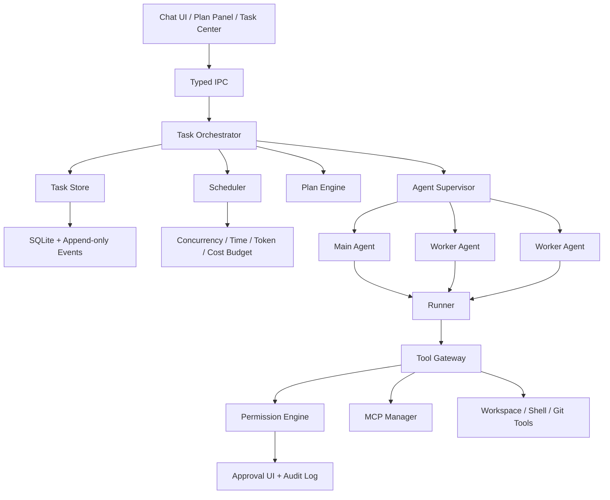
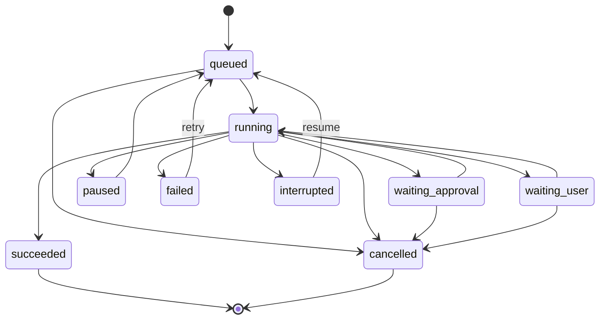
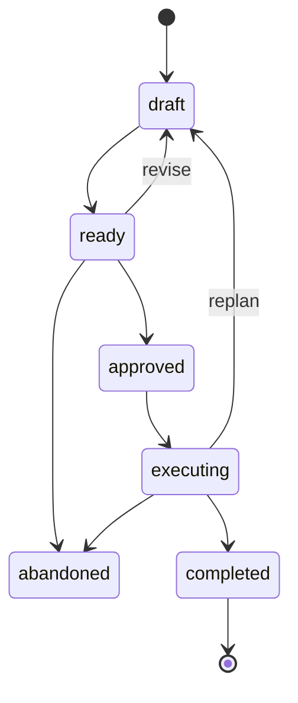

# Deki 多 Agent、后台任务与 Plan 模式完整规划

> 文档状态：规划稿
>
> 更新日期：2026-07-27
>
> 适用阶段：阶段 3 及后续版本
>
> 前置文档：[Deki 产品规划](./deki-product-plan.md)、[Deki 当前架构](./architecture.md)

## 1. 背景

Deki 当前已经具备 Agent Session、会话分叉、并发提交、Tool Gateway、权限控制、Git Checkpoint、长期记忆和基础运行状态持久化。

现有并发能力会从当前会话创建独立 Pi Session，并在内存中维护后台 Runtime。这证明了多会话并行执行的技术可行性，但它目前仍属于“并发会话”：

- 没有独立、稳定的 Task 和 Run 标识。
- 没有持久化任务队列。
- 缺少单任务取消、暂停、恢复和重试。
- 应用进程退出后无法继续运行。
- 任务、Agent、会话和计划之间没有统一的数据关系。
- 多个 Agent 写入同一工作区时缺少隔离。
- Plan 还不是可审批、可执行、可追踪的领域对象。

因此，后续不能直接在 `DekiAgentRuntime` 中继续累加后台任务、子 Agent 和计划逻辑，而应先建设统一的任务编排层。

## 2. 总体目标

建设一套本地优先、安全、可恢复的任务编排系统，使 Deki 能够：

1. 将长时间任务放到后台执行，并持续展示状态。
2. 在应用重启后准确恢复或明确中断任务。
3. 在 Plan 模式中只读分析并生成结构化执行计划。
4. 经用户批准后，将计划转换为可追踪的执行任务。
5. 由主 Agent 将独立工作分派给多个受约束的 Worker Agent。
6. 在 Git worktree 或其他隔离环境中安全并行修改。
7. 对模型调用、工具调用、费用、时间和权限进行统一预算与审计。
8. 支持未来的本地 daemon、容器、远程 Runner 和团队任务。

核心原则：

- Task 是用户可见的工作单元。
- Run 是 Task 的一次执行尝试。
- Agent 是 Run 的执行者。
- Session 保存模型上下文，但不承担任务编排职责。
- Plan 是版本化、可审批的执行规格。
- 多 Agent 数量不是目标，任务成功率和可控性才是目标。
- 每增加一级自主性，都必须同步增加隔离、预算、恢复、审计和用户控制。

## 3. 范围与非目标

### 3.1 第一阶段范围

- 持久化 Task、Run、Plan 和事件。
- 后台队列、并发控制和单任务操作。
- Plan/Act 两种明确模式。
- Plan 只读工具策略。
- Plan 审批和执行状态同步。
- 主 Agent 创建有限数量的只读 Worker。
- Worker 结构化返回结果。
- Task Center 和 Plan 面板。
- 应用崩溃或重启后的 interrupted 检测与人工恢复。

### 3.2 后续范围

- 独立后台 daemon。
- Git worktree 隔离写入。
- Plan DAG 动态调度。
- Agent Profile 和模型路由。
- 定时、Git、Issue 和文件变化触发器。
- Container、Remote 和 CI Runner。
- 团队任务和云同步。

### 3.3 暂不实现

- Worker 无限递归创建子 Agent。
- 多个 Agent 直接修改用户当前工作区。
- 未经批准自动提交、推送或合并代码。
- 第一版即设计复杂工作流语言。
- 第一版承诺桌面应用完全退出后任务仍继续执行。
- 仅依靠提示词保证 Plan 模式只读。

## 4. 概念模型

| 概念 | 定义 | 主要职责 |
|---|---|---|
| Task | 用户可见的工作单元 | 状态、目标、父子关系和最终结果 |
| Run | Task 的一次执行尝试 | 重试、模型使用、开始结束时间和错误 |
| Agent | 执行 Run 的模型会话 | 主 Agent、Worker、Reviewer、Integrator |
| Session | Pi 保存的模型上下文 | 消息、推理、压缩和会话分叉 |
| Plan | 可审阅的执行规格 | 步骤、依赖、风险、验证和版本 |
| Artifact | Agent 产生的交付物 | 报告、Patch、Commit、测试结果和证据 |
| Runner | 实际执行 Agent 和 Tool 的环境 | Local、Sandbox、Container、Remote、CI |

需要明确以下边界：

- 后台任务不等于子 Agent：一个后台任务可以只由一个主 Agent 执行。
- Plan 模式不等于单独的 Planner Agent：它首先是一套交互和权限策略。
- 子 Agent 不等于独立用户会话：Worker Session 默认属于父 Task，不直接出现在普通聊天列表中。
- 并发会话不等于可靠队列：可靠后台运行需要持久化状态、租约和恢复协议。

## 5. 总体架构



### 5.1 Task Orchestrator

负责：

- 创建、排队、启动和结束 Task。
- 创建 Run 并绑定 Agent Session。
- 维护父子任务和根任务关系。
- 执行取消、暂停、恢复和重试。
- 将 Plan 转换为 Task DAG。
- 处理 Worker 结果和 Artifact。
- 统一发出 Task Event。
- 在应用启动时恢复任务状态。

Task Orchestrator 不直接调用模型，也不直接执行 Tool。

### 5.2 Scheduler

负责：

- 最大并发 Task 数。
- 最大并发 Agent 数。
- 每个 Provider 的模型并发限制。
- Tool Gateway 并发限制。
- Task 优先级和公平调度。
- Token、费用、时间和 Tool Call 预算。
- 父任务与子任务之间的预算分配。
- 取消信号传播。

### 5.3 Agent Supervisor

负责：

- 创建和释放 Agent Runtime。
- 将 Agent Session 绑定到 Run。
- 为 Agent 加载 Profile、模型、Skill 和工具策略。
- 管理主 Agent 和 Worker 的生命周期。
- 将 Worker 的结构化输出提交给父 Agent。
- 处理 Agent 失联、超时和失败。

当前 `DekiAgentRuntime` 中的后台 Runtime 集合应逐步迁移到 Supervisor。

### 5.4 Plan Engine

负责：

- 创建和更新结构化 Plan。
- 保存 Plan revision。
- 校验步骤依赖和循环。
- 比较 Plan revision 差异。
- 将批准的 Plan 编译成 Task/Step。
- 在执行偏离计划时创建 Replan。

### 5.5 Task Store

第一版使用 SQLite，和 Pi Session JSONL 分离：

- Pi JSONL 保存模型会话。
- SQLite 保存 Task、Run、Plan、Artifact 和索引。
- Task Event 使用追加式记录。
- Task 和 Session 通过 `sessionId` 关联。
- UI 状态可从快照和事件恢复。

不建议把任务表放进 Memory Engine。两者可以使用同一种 SQLite 技术，但生命周期和治理规则不同。

## 6. 数据模型

### 6.1 Task

```ts
type TaskStatus =
  | "queued"
  | "running"
  | "waiting_approval"
  | "waiting_user"
  | "paused"
  | "succeeded"
  | "failed"
  | "cancelled"
  | "interrupted";

interface TaskRecord {
  id: string;
  workspaceId: string;
  rootTaskId: string;
  parentTaskId?: string;
  kind: "interactive" | "background" | "worker" | "plan-execution";
  title: string;
  goal: string;
  status: TaskStatus;
  priority: number;
  sessionId?: string;
  planId?: string;
  currentRunId?: string;
  assignedProfile?: string;
  createdAt: string;
  updatedAt: string;
  completedAt?: string;
}
```

### 6.2 Run

```ts
type RunStatus =
  | "queued"
  | "starting"
  | "running"
  | "waiting_approval"
  | "waiting_user"
  | "succeeded"
  | "failed"
  | "cancelled"
  | "interrupted";

interface RunRecord {
  id: string;
  taskId: string;
  attempt: number;
  status: RunStatus;
  sessionId?: string;
  runnerId: string;
  modelProvider?: string;
  modelId?: string;
  startedAt?: string;
  finishedAt?: string;
  error?: string;
  resultSummary?: string;
  inputTokens: number;
  outputTokens: number;
  toolCallCount: number;
}
```

### 6.3 Plan

```ts
type PlanStatus =
  | "draft"
  | "ready"
  | "approved"
  | "executing"
  | "completed"
  | "abandoned";

interface PlanRecord {
  id: string;
  workspaceId: string;
  sessionId: string;
  goal: string;
  status: PlanStatus;
  revision: number;
  assumptions: string[];
  constraints: string[];
  steps: PlanStep[];
  createdAt: string;
  updatedAt: string;
}

interface PlanStep {
  id: string;
  title: string;
  description: string;
  dependencies: string[];
  candidateFiles: string[];
  validation: string[];
  risk: "low" | "medium" | "high";
  parallelizable: boolean;
  assignedProfile?: string;
  status: "pending" | "running" | "completed" | "blocked" | "skipped";
}
```

### 6.4 Artifact

```ts
interface ArtifactRecord {
  id: string;
  taskId: string;
  runId: string;
  kind:
    | "report"
    | "evidence"
    | "patch"
    | "commit"
    | "test-result"
    | "diff"
    | "log";
  title: string;
  uri?: string;
  content?: string;
  metadata: Record<string, unknown>;
  createdAt: string;
}
```

### 6.5 Task Event

建议至少支持：

```text
task.created
task.queued
task.started
task.progress
task.waiting_approval
task.waiting_user
task.paused
task.resumed
task.succeeded
task.failed
task.cancelled
task.interrupted

run.created
run.started
run.completed
run.failed

agent.spawned
agent.completed
agent.failed

plan.created
plan.revised
plan.approved
plan.execution_started
plan.step_updated
plan.replan_requested

artifact.created
budget.warning
budget.exhausted
```

所有事件应包含：

- `eventId`
- `taskId`
- `runId`（如适用）
- `sessionId`（如适用）
- `timestamp`
- `sequence`
- `payload`

## 7. 状态机

### 7.1 Task 状态



### 7.2 Plan 状态



状态转换必须由 Orchestrator 统一执行，Renderer 不直接修改状态。

## 8. 后台任务规划

### 8.1 后台任务 V1

能力：

- 将新请求作为后台 Task 提交。
- 将正在运行的会话任务提升为后台任务。
- Task Center 查看所有任务。
- 单任务取消、重试和恢复。
- 展示状态、耗时、结果摘要、审批和错误。
- 后台任务完成后发送桌面通知。
- 用户切换会话或项目时任务继续执行。
- 多个任务共享 Scheduler，但保持独立 Session。
- 权限审批只暂停对应任务。

IPC 建议：

```ts
createTask(input): Promise<TaskRecord>
listTasks(filter?): Promise<TaskRecord[]>
getTask(taskId): Promise<TaskDetail>
cancelTask(taskId): Promise<CommandResult>
pauseTask(taskId): Promise<CommandResult>
resumeTask(taskId): Promise<CommandResult>
retryTask(taskId): Promise<CommandResult>
subscribeTaskEvents(listener): Unsubscribe
```

### 8.2 应用关闭语义

第一版：

- 窗口关闭但 Electron 主进程仍运行：任务继续。
- 用户明确退出应用：停止 Runtime，将运行中任务标记为 `interrupted`。
- 进程崩溃：下次启动通过未关闭 Run 和 Heartbeat 判断 interrupted。
- 用户可以选择恢复或重新开始。

后续 daemon：

- Desktop 只作为客户端。
- daemon 持有 Task Store、Scheduler、Agent Supervisor 和 Runner。
- Desktop 退出不影响任务。
- daemon 使用本机 IPC 和身份验证。
- 升级 daemon 前先安全排空或暂停任务。

### 8.3 恢复语义

不是所有 Tool Call 都能安全重放。每个 Tool 应逐步声明：

```ts
interface ToolExecutionTraits {
  readOnly: boolean;
  idempotent: boolean;
  resumable: boolean;
  concurrencySafe: boolean;
}
```

恢复策略：

- 已完成且幂等记录明确的步骤不重复执行。
- 未知执行结果的写入操作要求用户确认。
- 只读步骤可以自动重试。
- 外部副作用操作默认不自动重放。

## 9. Plan 模式规划

### 9.1 模式设计

Composer 第一版提供：

- `Act`：按当前权限策略执行任务。
- `Plan`：只读分析并生成结构化计划。

后续可增加：

- `Auto`：Agent 根据复杂度判断是否先规划。

模式属于 Session 或一次 Prompt，不应只作为全局设置。

### 9.2 Plan 模式工具策略

Plan 模式必须由 Tool Gateway 强制只读：

- 允许工作区读取和搜索。
- 允许明确判定为只读的 Shell 命令。
- 禁止文件写入和删除。
- 禁止依赖安装。
- 禁止 Git commit、push、checkout 等修改操作。
- 禁止 `mcp.write`。
- 网络读取是否允许由权限策略决定。
- 不明确是否有副作用的 Tool 默认禁止或询问。

Plan 模式只能通过专用 Tool 提交结构化计划：

```text
plan.submit
plan.revise
plan.validate
```

系统不能只依赖模型输出 Markdown 后再进行不可靠解析。

### 9.3 Plan UI

Plan 面板展示：

- 目标、假设和限制。
- 步骤顺序和依赖。
- 并行组。
- 风险级别。
- 预计修改文件。
- 验证方式。
- Plan revision Diff。
- 批准、要求修订、编辑和放弃。

第一版批准整个 Plan。后续增加：

- 单步批准。
- 高风险步骤单独批准。
- 批量批准低风险步骤。
- 锁定不可变约束。

### 9.4 Plan 执行

批准 Plan 后：

1. Plan 状态变为 `approved`。
2. Orchestrator 创建根 Task。
3. 每个 Plan Step 转为子 Task 或内部 Step。
4. Scheduler 根据依赖关系排队。
5. 可并行且无写入冲突的 Step 可以并行。
6. Step 状态实时回写 Plan。
7. 原有权限审批继续生效。
8. 最终验证完成后 Plan 变为 `completed`。

如果执行需要明显扩大范围：

- 暂停受影响步骤。
- 创建新 Plan revision。
- 展示差异和原因。
- 用户批准后继续。

以下情况一般应触发 Replan：

- 需要修改计划未列出的高风险模块。
- 需要增加依赖。
- 需要改变公共 API。
- 验证方案无法执行。
- 成本或时间预算明显超出。
- 原有假设被证明错误。

## 10. 多 Agent 规划

### 10.1 多 Agent V1

第一版只实现受控的主从模式：

- 主 Agent 可以创建 Worker。
- Worker 不能继续创建 Worker。
- 每个根 Task 默认最多 2～4 个 Worker。
- Worker 默认只读。
- Worker 拥有独立 Session。
- Worker 只获得完成子任务所需的上下文包。
- Worker 通过结构化结果返回证据和结论。
- 主 Agent 负责综合，不直接拼接所有 Worker 对话。

适合分派的任务：

- 搜索相关代码。
- 分析测试失败。
- 调查不同模块。
- 阅读依赖或协议文档。
- 安全和回归风险检查。
- 对实现方案进行审查。

不适合并行的任务：

- 高度依赖前一步结论的连续工作。
- 多个 Worker 同时修改同一组文件。
- 很小、分派成本高于执行成本的任务。
- 需要完整共享推理上下文的任务。

### 10.2 Agent Profile

后续内置：

| Profile | 职责 | 默认权限 |
|---|---|---|
| Explorer | 搜索代码、收集证据 | 只读 |
| Planner | 生成和修订 Plan | 只读 |
| Implementer | 隔离环境修改代码 | 工作区隔离写 |
| Tester | 执行测试和分析失败 | Shell + 受限写 |
| Reviewer | 检查实现、风险和回归 | 只读 |
| Integrator | 合并 Patch、解决冲突 | 集成分支写 |

Profile 应声明：

- System Prompt。
- 默认模型及回退模型。
- 可用 Skill。
- Tool 白名单。
- 权限策略。
- Token 和时间预算。
- 最大重试次数。
- 输出 Schema。

### 10.3 Worker 上下文包

Worker 不应继承父 Session 的全部历史。上下文包包含：

- 根任务目标。
- 子任务目标。
- 明确的完成标准。
- 相关 Plan Step。
- 必要文件、代码符号或搜索线索。
- 当前约束。
- 已知事实。
- 允许使用的 Tool 和预算。

Worker 输出至少包含：

```ts
interface WorkerResult {
  summary: string;
  findings: Array<{
    claim: string;
    evidence: string[];
    confidence: number;
  }>;
  artifacts: string[];
  risks: string[];
  unresolved: string[];
  recommendedNextActions: string[];
}
```

### 10.4 嵌套 Agent

仅在系统稳定后考虑：

- 最大深度为 2。
- 每个根 Task 的 Agent 总数有限。
- 子任务预算从父任务预算扣除。
- 所有 Agent 可追溯到根 Task。
- 父 Agent 取消时向所有后代传播。
- Agent 之间通过 Orchestrator 通信，不直接维护任意网络。

## 11. 并行写入与隔离

### 11.1 风险

Git Checkpoint 可以帮助恢复，但不能防止两个 Agent 同时覆盖同一文件。因此，在缺少隔离时：

- 只允许一个写入 Agent。
- 其他 Worker 保持只读。
- 主 Agent 执行最终写入。

### 11.2 Git worktree 方案

写入型 Worker 使用独立 worktree：

```text
用户工作区
  ├── 主会话：只读观察或最终集成
  ├── Worker A worktree：实现模块 A
  ├── Worker B worktree：实现模块 B
  └── Integration worktree：合并与测试
```

流程：

1. 为 Worker 创建临时分支和 worktree。
2. Worker 修改并运行相关测试。
3. Worker 生成 Commit 或 Patch Artifact。
4. Reviewer 检查结果。
5. Integrator 在临时集成分支合并。
6. 运行跨模块测试。
7. 展示最终 Diff 和冲突。
8. 用户确认后合入目标工作区。
9. 清理 worktree 和临时分支。

### 11.3 冲突策略

调度前：

- 根据 Plan 的 `candidateFiles` 估计重叠。
- 高概率重叠步骤改为串行。
- lockfile、数据库迁移和公共类型文件默认独占。

执行后：

- 自动检测真实文件重叠。
- 无冲突时自动进入集成测试。
- 有冲突时创建 Integration Task。
- 重大语义冲突请求用户决定，不由 Agent 静默选择。

### 11.4 非 Git 项目

第一版保持单写入 Agent。后续可以使用：

- 临时目录副本。
- Overlay filesystem。
- 容器卷快照。
- 结构化 Patch 导出。

## 12. 权限、安全与预算

### 12.1 权限继承

- 子 Task 默认不能获得超过父 Task 的权限。
- Worker Profile 可以进一步收紧权限。
- 一次性授权绑定到具体 Task、Tool 和参数范围。
- 项目级永久授权仍由现有 Permission Engine 管理。
- Worker 请求的审批显示父任务和 Agent 身份。

### 12.2 Secret

- Secret 按 Tool 和 Provider 注入。
- Worker 只获得明确需要的 Secret。
- Secret 不进入 Session、Task Event 或 Artifact。
- 远程 Runner 使用短期凭证。

### 12.3 预算

建议支持：

```ts
interface TaskBudget {
  maxAgents: number;
  maxRuns: number;
  maxDurationMs: number;
  maxInputTokens?: number;
  maxOutputTokens?: number;
  maxToolCalls?: number;
  maxEstimatedCost?: number;
}
```

预算行为：

- 达到 80% 时发出警告。
- 达到硬上限时暂停或终止。
- Worker 预算从父 Task 分配。
- 模型切换和重试必须计入预算。
- 用户可以追加预算后恢复。

### 12.4 审计

审计树应支持：

```text
Task
  └── Run
      └── Agent
          ├── Model Call
          ├── Tool Call
          ├── Approval
          └── Artifact
```

所有危险操作必须能定位到：

- 哪个用户任务。
- 哪个 Plan Step。
- 哪个 Agent。
- 哪次 Run。
- 使用什么模型。
- 获得了什么授权。
- 最终成功或失败。

## 13. UI 与交互

### 13.1 Composer

- Act/Plan 模式切换。
- “在后台运行”入口。
- 当前并发和预算提示。
- Plan 模式只读标识。

### 13.2 Task Center

建议按照以下分组：

- Running
- Needs attention
- Queued
- Completed
- Failed/Interrupted

每个任务展示：

- 标题和项目。
- 状态和进度。
- 主 Agent/Worker 数。
- 已运行时间。
- Token 或费用。
- 当前 Plan Step。
- 审批、取消、暂停、恢复和重试。
- 打开对应会话、Plan、Diff 和 Artifact。

### 13.3 Agent Tree

在任务详情中展示：

```text
修复登录测试失败
├── Explorer：分析认证模块
├── Explorer：分析测试与 fixture
├── Implementer：修复 token 刷新
├── Tester：运行相关测试
└── Reviewer：检查回归风险
```

默认展示摘要，不把所有 Agent 的完整消息混进主聊天。

### 13.4 通知

- 任务完成。
- 任务失败。
- 等待审批。
- 等待用户补充信息。
- 预算即将耗尽。
- Replan 等待批准。

## 14. 包与代码结构规划

建议逐步调整为：

```text
packages/
├── agent-runtime/
│   ├── Pi Session 适配
│   ├── Agent Profile
│   └── Session Event 转换
├── task-orchestrator/
│   ├── orchestrator.ts
│   ├── scheduler.ts
│   ├── supervisor.ts
│   ├── task-store.ts
│   ├── recovery.ts
│   └── events.ts
├── plan-engine/
│   ├── schema.ts
│   ├── validator.ts
│   ├── compiler.ts
│   └── revisions.ts
├── runner/
│   ├── local-runner.ts
│   ├── worktree-runner.ts
│   └── runner.ts
├── tool-gateway/
├── permission-engine/
├── git-checkpoint/
└── shared/
```

第一版可以把 Plan Engine 放在 `task-orchestrator` 内，等协议稳定后再拆包。

### 14.1 `shared`

新增：

- Task、Run、Plan、Artifact Schema。
- Task Event Schema。
- IPC 输入输出 Schema。
- Agent Profile 和 Budget Schema。

### 14.2 `agent-runtime`

逐步移出：

- 后台 Runtime 集合。
- 全局并发任务计数。
- 后台任务恢复。
- Worker 父子关系。

保留：

- Pi AgentSession 创建和配置。
- Session 事件翻译。
- 模型、Skill、Memory 上下文注入。
- Agent 级 prompt、abort 和 dispose。

### 14.3 Desktop Main

- 持有 Task Orchestrator。
- 提供 Task 和 Plan IPC。
- 在启动时执行恢复。
- 管理系统通知和关闭策略。

### 14.4 Renderer

- Task Center。
- Plan 面板。
- Agent Tree。
- Artifact 和预算展示。
- 只消费 Deki Task Event，不依赖 Pi 原始事件。

## 15. 实施阶段

### 15.1 M1：Task Core

预计：4～6 个工作日。

任务：

- 定义 Task、Run、Artifact 和事件 Schema。
- 创建 SQLite Task Store 和迁移。
- 实现 Task 状态机。
- 实现基础 Scheduler。
- 实现单任务 AbortController。
- 将当前并发分叉迁移到 Task Orchestrator。
- 保持现有并发提交 UI 可用。

验收：

- 每个并发运行都有稳定 Task ID。
- Task 状态在切换会话后仍可查询。
- 可以单独取消一个后台任务。
- 重启后运行中任务被准确识别为 interrupted。

### 15.2 M2：后台任务 V1

预计：4～5 个工作日。

任务：

- Task Center。
- 后台提交入口。
- 单任务取消、暂停、恢复和重试。
- 等待审批和等待用户状态。
- 桌面通知。
- 任务搜索和项目过滤。
- Session、Task 和运行结果互相跳转。

验收：

- 用户切换项目和会话后任务继续运行。
- 一个任务等待审批时其他任务可继续。
- 完成结果能从 Task Center 打开。

### 15.3 M3：Plan 模式 V1

预计：4～6 个工作日。

任务：

- Act/Plan 模式。
- Tool Gateway 只读策略。
- Plan Schema、Store 和 revision。
- `plan.submit` 和 `plan.revise`。
- Plan 面板。
- 批准 Plan 后创建执行 Task。
- Plan Step 与 Task 状态同步。

验收：

- Plan 模式无法写文件或执行副作用 Tool。
- 计划可以保存、修订、批准和放弃。
- 批准后能按步骤执行。
- 结果明显偏离计划时可以暂停并请求 Replan。

### 15.4 M4：只读多 Agent

预计：6～8 个工作日。

任务：

- Agent Supervisor。
- Worker Task 和父子关系。
- Explorer、Tester、Reviewer Profile。
- Worker 上下文包和输出 Schema。
- Worker 数量、时间和 Token 预算。
- Agent Tree UI。
- 主 Agent 汇总 Worker 结果。

验收：

- 主 Agent 可并行派发两个独立调查任务。
- Worker 不能写入工作区。
- Worker 结果带证据并能追溯。
- 取消父 Task 会取消所有 Worker。

### 15.5 M5：隔离写入多 Agent

预计：6～10 个工作日。

任务：

- Worktree Runner。
- Implementer 和 Integrator Profile。
- Commit/Patch Artifact。
- 文件重叠检测。
- 临时集成分支。
- 合并冲突流程。
- 集成测试。
- 自动清理临时资源。

验收：

- 两个 Worker 可以在独立 worktree 修改不同模块。
- 用户当前工作区不被中间状态污染。
- 合并冲突不会被静默覆盖。
- 最终合并前展示完整 Diff 和测试结果。

### 15.6 M6：后台 daemon

预计：8～12 个工作日。

任务：

- 独立本地服务。
- 本机 IPC。
- Task Lease 和 Heartbeat。
- Desktop 重连。
- daemon 升级和关闭策略。
- 完整崩溃恢复。

验收：

- Desktop 完全退出后任务继续。
- Desktop 重新打开后恢复实时状态。
- daemon 异常终止不会造成任务状态不明。

### 15.7 M7：智能 DAG 与模型路由

预计：8～12 个工作日。

任务：

- Plan DAG 校验和调度。
- 自动选择串行或并行。
- 按任务类型选择模型。
- 预算感知降级。
- Worker 失败后的模型回退。
- Reviewer 和 Integrator 自动插入。

验收：

- 相比单 Agent，目标评测集成功率明显提高。
- 并行执行能降低耗时，且成本在预算内。
- 不必要的小任务不会创建 Worker。

## 16. 长期升级路线

### 16.1 Runner 扩展

- Local Runner。
- 受限 Sandbox Runner。
- Container Runner。
- Remote Runner。
- CI Runner。

Task Orchestrator 只能依赖 Runner 接口，不能依赖 Electron 或具体进程实现。

### 16.2 触发器

- 定时任务。
- 文件变化。
- Git commit/branch 变化。
- GitHub Issue 和 PR。
- MCP Event。
- CLI 和外部 API。

### 16.3 生态

- Task/Plan 模板。
- Skill 声明推荐 Agent Profile。
- MCP Tool 声明只读、幂等和并发安全属性。
- Profile 和工作流市场。
- 可复现任务包导出。

### 16.4 团队与云端

放到本地版本稳定之后：

- 多设备同步。
- 共享 Task 和 Artifact。
- 团队 Runner。
- 组织权限策略。
- 审批人和责任人。
- 云端队列和成本中心。

## 17. 测试与评测

### 17.1 单元测试

- Task 和 Plan 状态机。
- Scheduler 公平性。
- 预算扣减。
- 父子取消传播。
- Plan DAG 循环检测。
- 权限继承。
- 恢复策略。

### 17.2 集成测试

- 多 Task 并发。
- 审批暂停不阻塞其他 Task。
- 应用重启和 interrupted 恢复。
- Worker 超时和失败。
- Plan 批准执行和 Replan。
- Worktree 创建、合并和清理。
- Tool 结果未知时的安全恢复。

### 17.3 Electron E2E

- 创建后台任务。
- 切换项目后查看任务。
- 在 Task Center 取消和重试。
- Plan 模式写入被拒绝。
- 批准 Plan 并查看步骤状态。
- 查看 Agent Tree 和 Artifact。

### 17.4 真实项目评测集

至少包括：

- 定位并修复单元测试失败。
- 跨文件 Bug 修复。
- 小型模块重构。
- 依赖升级。
- 安全审查。
- 多模块并行修改。
- 合并冲突处理。
- 中途重启恢复。

每个任务比较：

- 单 Agent。
- Plan + 单 Agent。
- Plan + 多 Agent。
- 不同模型和预算配置。

## 18. 指标

| 指标 | 目标 |
|---|---|
| Task 成功率 | 衡量最终任务质量 |
| 首次 Run 成功率 | 减少无效重试 |
| 重启恢复成功率 | 衡量后台可靠性 |
| Plan 偏离率 | 衡量规划准确性 |
| Worker 有效贡献率 | 判断多 Agent 是否值得 |
| 合并冲突率 | 衡量任务拆分质量 |
| 审批次数/Task | 控制用户打断 |
| Token/Task | 控制模型成本 |
| 耗时/Task | 衡量并行收益 |
| Tool 失败率 | 发现环境和协议问题 |
| interrupted 后重复副作用数 | 必须保持为零 |

多 Agent 上线门槛不应只看功能完成，而应满足：

- 目标评测集成功率高于单 Agent。
- 平均成本增长可解释。
- 并行任务平均耗时降低。
- 不增加不可恢复的工作区污染。

## 19. 主要风险与应对

### 19.1 状态重复

风险：Desktop Main、Agent Runtime、Task Store 同时维护运行计数和状态。

应对：

- Task Store 是持久化事实来源。
- Scheduler 是运行资源事实来源。
- Renderer 只消费快照和事件。
- Agent Runtime 不再维护全局 Task 状态。

### 19.2 事件乱序

风险：多个 Session 并发发出事件，UI 状态被旧事件覆盖。

应对：

- 每个 Task Event 带单调 `sequence`。
- 写 Store 成功后再广播。
- UI 根据 Task 和 sequence 去重。

### 19.3 重复副作用

风险：恢复或重试造成重复写入、重复 Issue 或重复推送。

应对：

- Tool Trait。
- Idempotency Key。
- 外部副作用默认要求确认。
- Run 和 Tool Call 保留执行记录。

### 19.4 上下文爆炸

风险：主 Agent 收到所有 Worker 完整历史。

应对：

- Worker 使用结构化摘要。
- Artifact 按需读取。
- Worker 独立压缩。
- 父 Agent 只接收结论、证据和未解决问题。

### 19.5 多 Agent 成本失控

应对：

- 默认最多两个 Worker。
- 小任务不并行。
- 子任务硬预算。
- 低成本模型处理搜索和总结。
- 预算达到阈值自动停止扩张。

### 19.6 写入冲突

应对：

- V1 只读 Worker。
- 单写入 Agent。
- 后续 worktree 隔离。
- 调度前文件重叠分析。
- 临时集成分支和完整测试。

## 20. 版本建议

| 版本 | 核心目标 |
|---|---|
| `0.4` | Task Core、持久化后台任务、单任务控制 |
| `0.5` | Plan 模式、Plan 审批执行、Replan |
| `0.6` | 只读 Worker、Agent Profile、Agent Tree |
| `0.7` | Git worktree 隔离写入、集成流程 |
| `0.8` | daemon、定时任务、可靠恢复 |
| `0.9` | 智能 DAG、模型路由、预算优化和评测 |
| `1.0` | 稳定协议、跨平台可靠性、安全审计和迁移兼容 |

## 21. 完整验收场景

用户在 Plan 模式输入：

> 分析登录相关测试失败的原因，制定修复计划，批准前不要修改代码。

Deki 应完成：

1. 使用只读 Tool 检查测试、认证模块和项目说明。
2. 生成包含依赖、风险、文件范围和验证方式的结构化 Plan。
3. 保证 Plan 模式没有发生文件修改。
4. 用户批准 Plan。
5. Orchestrator 创建根 Task 和步骤。
6. 主 Agent 并行创建两个只读 Worker，分别调查实现和测试。
7. Worker 返回带文件位置和证据的结构化结果。
8. 主 Agent 综合结果并创建写入步骤。
9. 写入 Agent 在隔离 worktree 中修改代码。
10. Tester 运行相关测试。
11. Reviewer 检查行为变化和回归风险。
12. Integrator 在临时分支合并并运行集成测试。
13. 用户在 Task Center 查看进度、处理审批并检查最终 Diff。
14. 用户切换会话或重启 Desktop 后仍能恢复任务状态。
15. 用户批准后才将结果合入当前工作区。
16. Task 保存最终摘要、Plan、Diff、测试结果和完整审计链。

## 22. 推荐实施顺序

最终推荐顺序：

```text
Task Core
  → 后台任务 V1
  → Plan 模式 V1
  → 只读多 Agent
  → Git worktree 隔离写入
  → 后台 daemon
  → 智能 DAG 与模型路由
  → Runner、触发器和生态
  → 团队与云端能力
```

在以下条件满足前，不进入可写多 Agent：

- Task 状态能够可靠持久化和恢复。
- 单任务取消和审批暂停稳定。
- Plan 模式的只读约束由 Tool Gateway 强制。
- Worker 结果可以完整追溯。
- 父子任务预算和取消传播已经生效。

在以下条件满足前，不进入 daemon 和远程 Runner：

- 本地 Task Store 的迁移和恢复协议稳定。
- Tool 幂等性和未知执行结果处理规则明确。
- Secret 可以按 Task、Agent 和 Tool 最小化注入。
- 任务协议不再依赖 Electron Renderer 或 Pi 原始事件。
